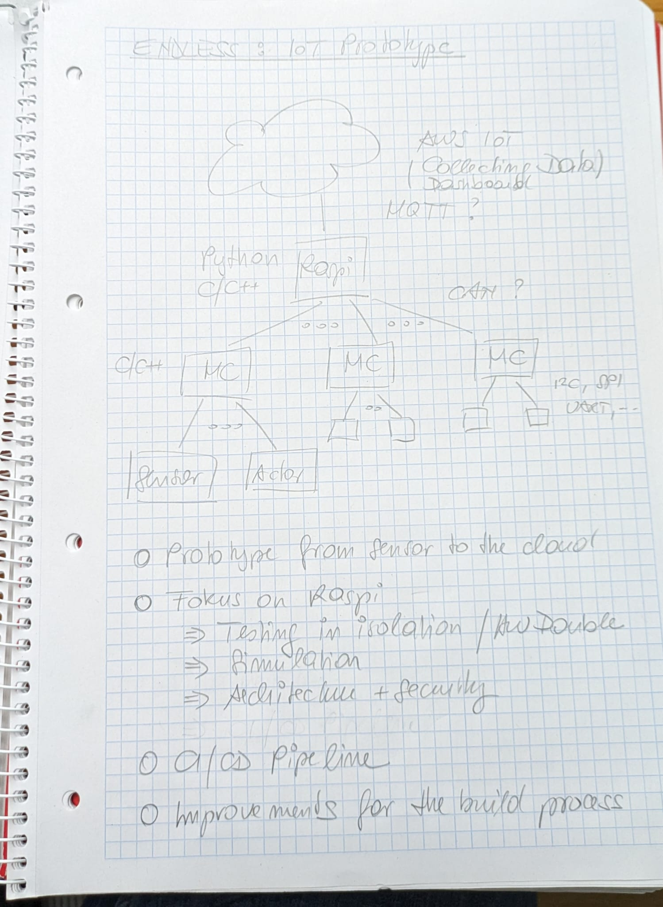

The ENDLESS Project
===================

.. contents::
   :local:

.. toctree::
   :hidden:

   raspi/index
   yocto/index
   misc-notes/index
   todo

.. sidebar:: Source Code

   * https://github.com/jfasch/FH-ENDLESS

Project Overview
----------------

Demo Application
................

.. sidebar:: See also

   * :doc:`raspi/index`
   * :doc:`raspi/satellite/index`

A demo application has been created. Actually, the demo application
consists of multiple programs:

* The :doc:`main application <raspi/index>`, running on Linux. It uses
  Linux's hardware capabilities (:doc:`CAN bus
  <jfasch:trainings/material/soup/linux/hardware/can/index>`, mostly,
  but not necessarily so) to communicate with sensor and actor
  devices - usually deeply embedded controllers with specialized
  firmware.
* *Simulations* of :doc:`sensor and actor devices
  <raspi/satellite/index>`. Small Linux programs - for testing only -
  that mimic the behavior of embedded controllers.

Embedded Linux OS Images
........................

.. sidebar:: See also

   * :doc:`/yocto/index`

A set of :doc:`Yocto-built Linux OS images <yocto/index>` for
different purposes.

* Packaging the demo application and various configurations together
  with an entire OS that runs the application.
* General purpose OS, for educational use.

The Beginning Of It All
-----------------------

The project originated from a sketch scribbled on paper. In that
sketch, the node labeled "Raspi" is the :doc:`main application
<raspi/index>`, and the ones labeled "MC" are instances of some of the
:doc:`sensor and actor devices <raspi/satellite/index>`.

