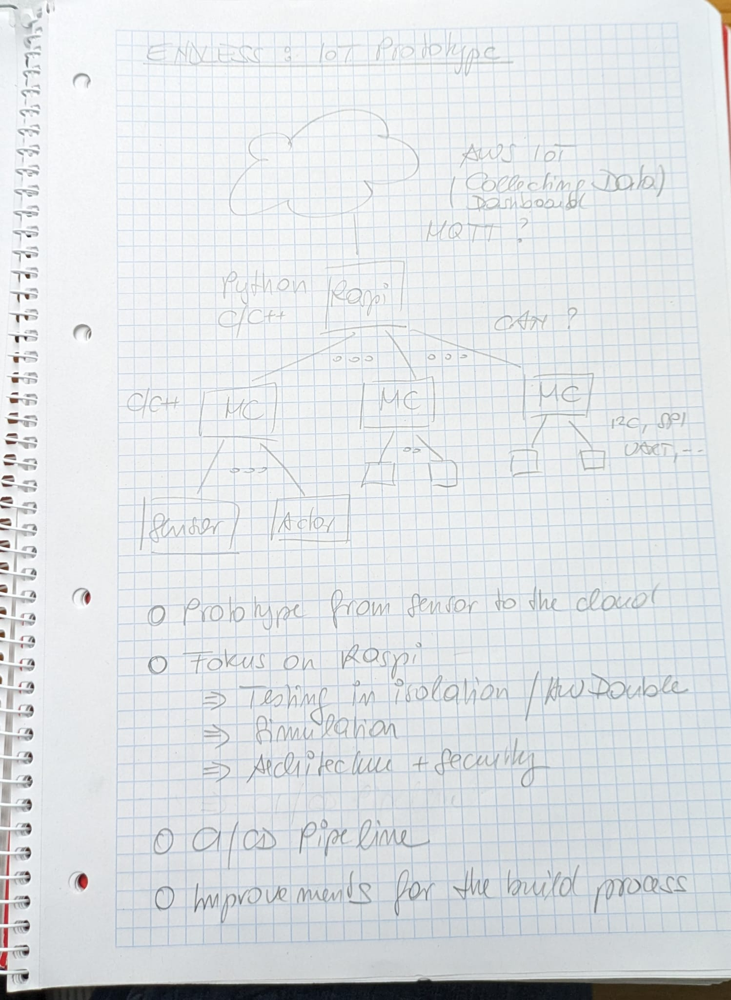

The ENDLESS Project
===================

.. contents::
   :local:

The Beginning Of It All
-----------------------

``Raspi/``
----------

In the sketch, this is the node labaled "Raspi". A datalogger,
basically, capable of

* receiving measurements from various *sources*

  * CAN bus
  * MQTT
  * Random simulated data
  * ... to be continued ...

* sending measurements to various *sinks*

  * MQTT
  * Standard output (aka "console")
  * `InfluxDB <https://docs.influxdata.com/influxdb>`__ to come soon
  * ... to be continued ...

``MC-1/``
---------

In the sketch, this resembles one of the nodes labeled "MC". A Python
program that does not produces any real measurments, but generates a
configurable sine wave that it sends out over a CAN interface. It runs
on Linux, either with real CAN hardware, or (likely) using a `Virtual
CAN interface
<https://www.faschingbauer.me/trainings/material/soup/linux/hardware/can/group.html>`__.

The "Raspi" node is supposed to pick that up as one of its sources.
